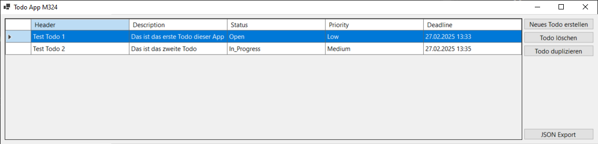
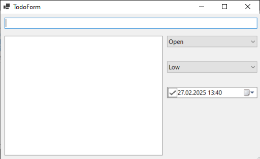
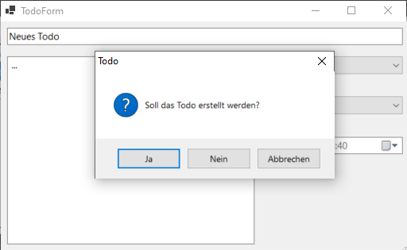
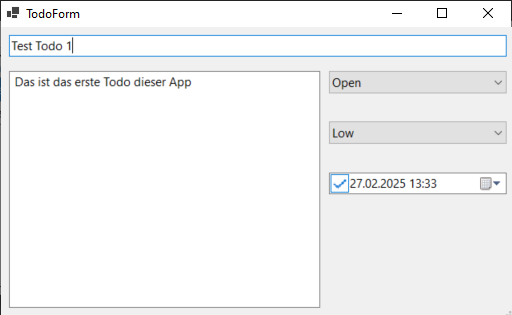
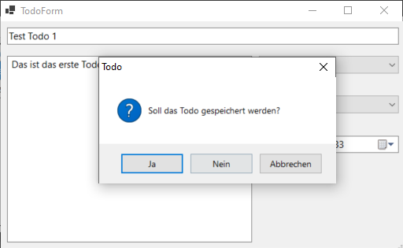
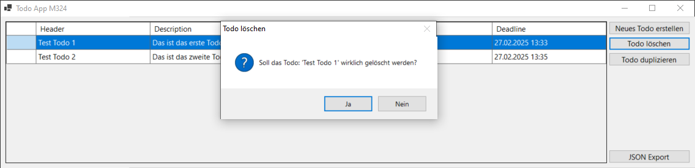
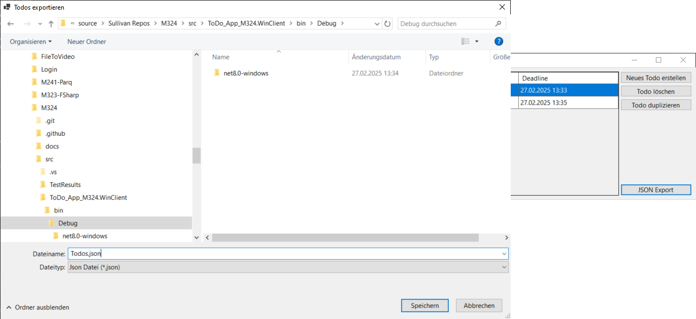

# Anleitung Windows-Forms

- [Anleitung Windows-Forms](#anleitung-windows-forms)
  - [Start der App](#start-der-app)
  - [Neues Todo erstellen](#neues-todo-erstellen)
  - [Todo bearbeiten](#todo-bearbeiten)
  - [Todo löschen](#todo-löschen)
  - [JSON Export](#json-export)

## Start der App

Beim Start der App werden automatisch alle gespeicherten Todos geladen und in der Tabelle dargestellt

## Neues Todo erstellen

Über die Funktion 'Neues Todo erstellen' öffnet sich folgende Maske, in der die Eigenschaften des neues Todos bearbeitet werden können

Beim speichern erscheint dann folder Dialog, mit folgenden Optionen

- **Ja:** Das Todo wird erstellt und die Maske wird geschlossen
- **Nein:** Das Todo wird **nicht** erstellt und die Maske wird geschlossen
- **Abbrechen:** Der Dialog schliesst sich und man kan das Todo weiterbearbeiten

## Todo bearbeiten

Um ein Todo zu bearbeiten muss man die Zeile in der Hauptansicht doppelklicken.
Dann öffnet sich folgende Maske

Beim speichern erscheint dann folder Dialog, mit folgenden Optionen

- **Ja:** Das Todo wird gespeichert und die Maske wird geschlossen
- **Nein:** Das Todo wird **nicht** gespeichert und die Maske wird geschlossen
- **Abbrechen:** Der Dialog schliesst sich und man kan das Todo weiterbearbeiten

## Todo löschen

Über die Funktion 'Todo löschen' kann ein existierendes Todo gelöscht werden. \
Nach dem Ausführen der Funktion wird der Benutzer gefragt, ob er sich sicher ist das Todo zu löschen.
Wenn dieser dann mit 'Ja' bestätigt wird das Todo gelöscht.

## JSON Export

Um alle Todos als JSON zu exportieren gibt es die Funtion 'JSON Export'
Nach dem ausführen der Funktion öffnet sich ein Speicherdialog für die JSON-Datei

Wenn man diesen Dialog nun bestätigt wird die Datei unter dem angegebenen Pfad gespeichert.
